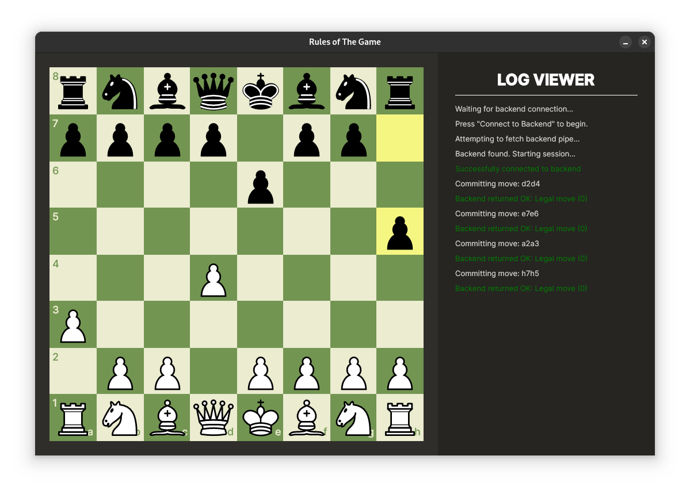

# Chess—Backend

A cross-platform move validator serving as a backend to the [Chess Frontend](https://github.com/StavWasPlayZ/chess-frontend).

Communicates via **named pipes** in Windows and a **FIFO file** in Linux/Unix—depending on the active operating system.

Submitted as part of the Magshimim National Cyber Program year 2, sem. 1 project.

## In This Project

- The fundamental implementations and rules of a Chess game
  - Pawn-switching
  - En Passant
- Cross-platform support for Windows and Unix-based systems
